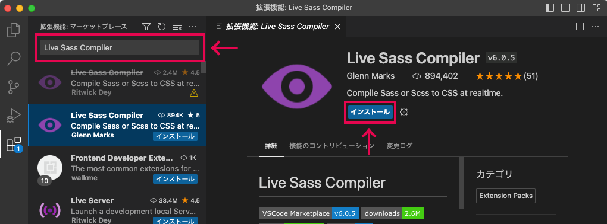
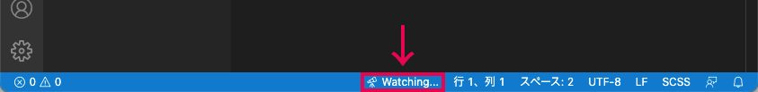
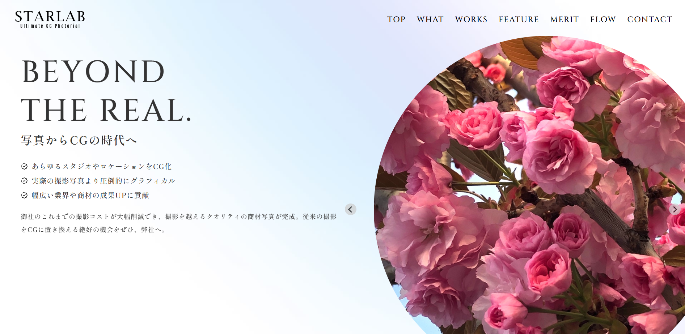
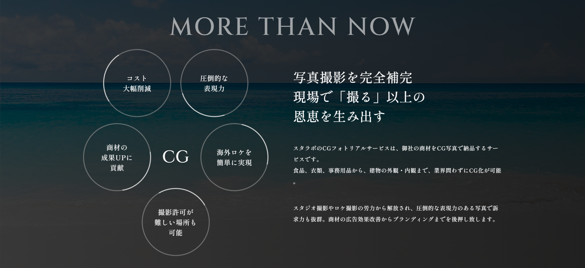
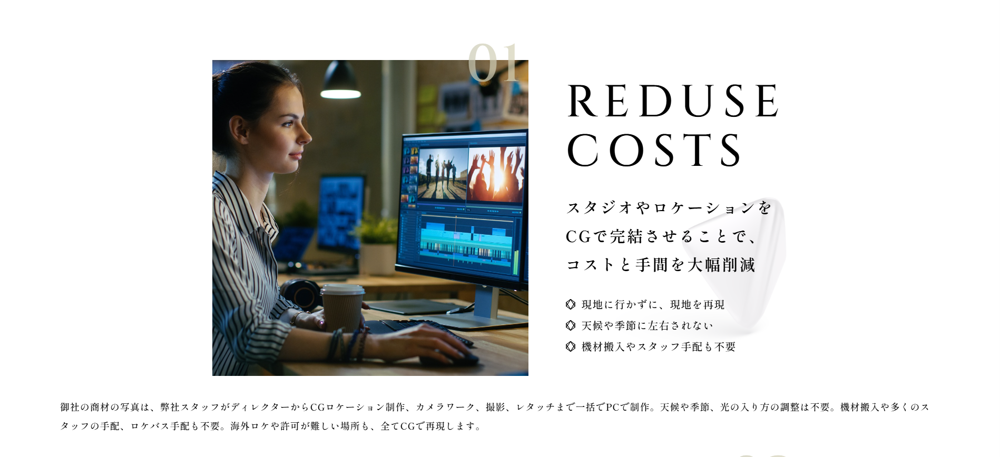
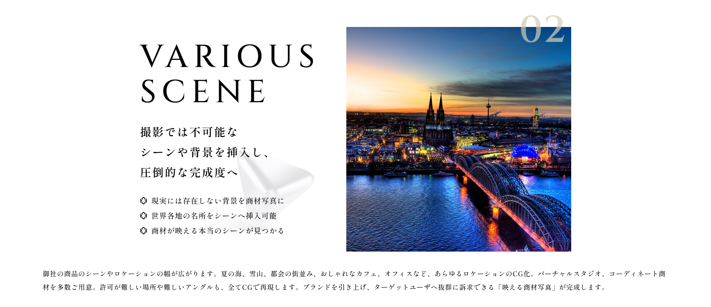
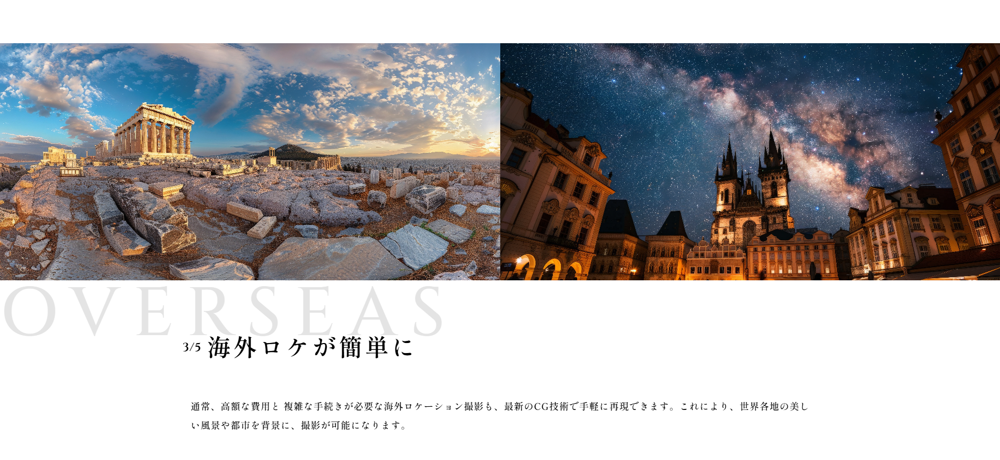
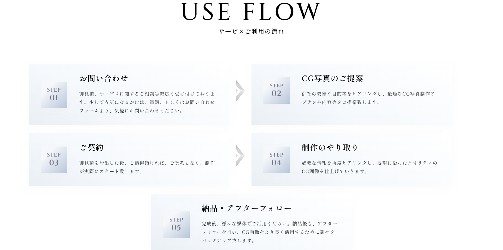
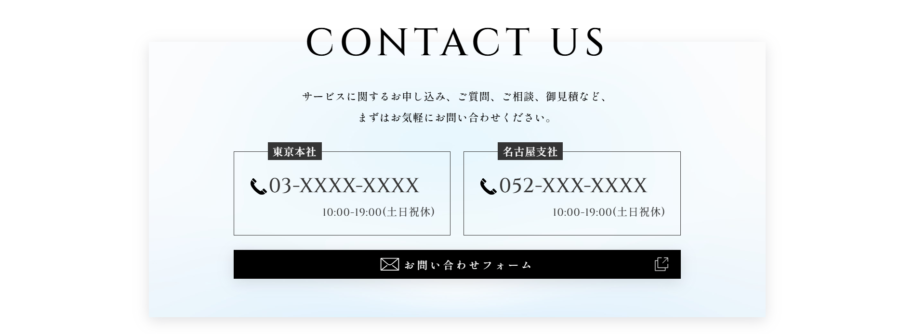
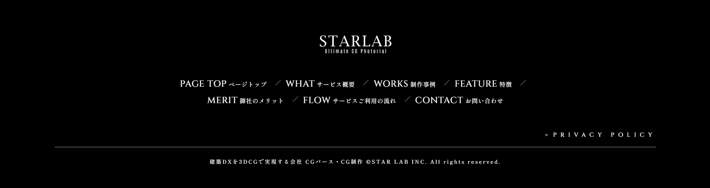

# starlab

## 概要
複雑なアニメーションを実装したwebサイトの構築

## 参照先
Udemy
【超本格派】これが作れたら一流！圧倒的クオリティのWebサイト制作講座
https://www.udemy.com/course/genuine-website/?couponCode=CP130525JP

## ダウンロード
1. git clone https://github.com/Takumi8888/starlab.git
2. cd starlab
3. git remote set-url origin git@github.com:Takumi8888/starlab
4. code .

## Webサイト表示について
### SCSSのコンパイルについて
今回scssを使用しているため、下記手順をお願い致します。
1. 拡張機能である「Live Sass Compiler」をインストールする。

2. インストール後、ステータスバーに「Watch Sass」が表示されます。

3. 「Watch Sass」を押下しSassファイルを保存した時、自動でCSSファイルにコンパイルされます。

### htmlファイルについて
htmlファイルについては、index.htmlにてご確認ください。

| ファイル名            | 画面読み込み時のloading |
| :---                 | :---:                  |
| index.html           | loading：有            |
| index-noloading.html | loading：無            |

## Webサイト画面

